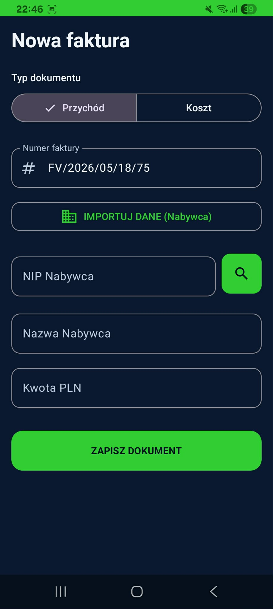
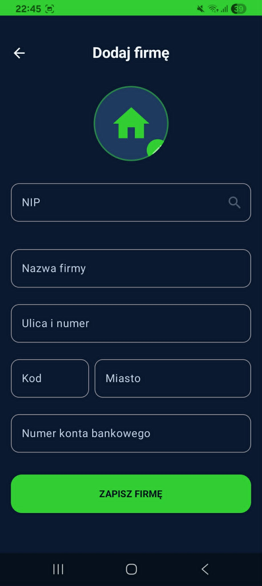

# E-Faktura 📑


Nowoczesna aplikacja mobilna na system Android wspierająca przedsiębiorców w codziennym zarządzaniu finansami.  
Aplikacja umożliwia szybkie wystawianie faktur, zarządzanie kontrahentami oraz generowanie profesjonalnych dokumentów PDF zgodnych z polskimi standardami księgowymi.

---

# 📱 Zrzuty Ekranu

<p align="center">
  
  
  
</p>

<p align="center">
  
  
</p>

---

# ✨ Funkcje

## 📌 Zarządzanie Fakturami

- Tworzenie faktur sprzedażowych i zakupowych
- Dynamiczne oznaczanie stron transakcji (Nabywca / Sprzedawca)
- Status płatności faktur
- Automatyczne obliczanie wartości netto i brutto

---

## 🏢 Integracja z Białą Listą Ministerstwa Finansów

Aplikacja wykorzystuje publiczne API Ministerstwa Finansów:

- automatyczne pobieranie danych firmy po numerze NIP,
- weryfikacja numeru rachunku bankowego,
- pobieranie adresu działalności gospodarczej.

Źródło API: https://wl-api.mf.gov.pl/

---

## 🧠 Inteligentny Parser Adresów

Autorski mechanizm parsowania adresów oparty na wyrażeniach regularnych (Regex):

- rozdzielanie ulicy,
- kodu pocztowego,
- miasta,
- numerów lokali i budynków.

Pozwala to automatycznie uzupełniać formularze bez ręcznej edycji danych.

---

## 📄 Generowanie PDF

- generowanie profesjonalnych dokumentów PDF,
- gotowe pliki do wysłania klientowi,
- bezpieczne udostępnianie dokumentów poprzez `FileProvider`,
- przechowywanie plików w pamięci cache aplikacji.

---

## 📊 Dashboard Finansowy

Panel finansowy umożliwia:

- śledzenie rzeczywistego przychodu,
- kontrolę kosztów,
- monitorowanie nieopłaconych faktur,
- szybki podgląd aktualnej sytuacji finansowej.

---

# 🛠️ Stack Technologiczny

| Kategoria | Technologia |
|---|---|
| Język | Kotlin |
| UI | Jetpack Compose |
| Architektura | MVVM |
| Reactive Streams | StateFlow / SharedFlow |
| Networking | Retrofit + Gson |
| Baza Lokalna | Room |
| Chmura | Firebase Firestore |
| PDF | Android PDF APIs |
| Udostępnianie plików | FileProvider |

---

# 🏗️ Architektura

Projekt został oparty o architekturę MVVM z wyraźnym podziałem odpowiedzialności:

```text
ui/        -> Ekrany Compose, ViewModele, stany UI
data/      -> Repozytoria, API, źródła danych
model/     -> Modele biznesowe i DTO
utils/     -> Narzędzia pomocnicze, generator PDF
```

W komunikacji UI wykorzystano:

- `StateFlow` do zarządzania stanem,
- `SharedFlow` do obsługi zdarzeń jednorazowych,
- separację logiki biznesowej od warstwy prezentacji.

---

# 🔧 Instalacja

## 1. Klonowanie repozytorium

```bash
git clone https://github.com/MatysiakQ/e-faktura.git
```

## 2. Firebase

Dodaj plik:

```text
google-services.json
```

do katalogu:

```text
app/
```

---

## 3. Synchronizacja projektu

Uruchom:

```text
Sync Project with Gradle Files
```

następnie uruchom aplikację na:

- emulatorze Androida,
- lub fizycznym urządzeniu.

---

# 🔐 Bezpieczeństwo i Zarządzanie Plikami

Aplikacja implementuje bezpieczny mechanizm zarządzania dokumentami poprzez `FileProvider`.

Dzięki temu:

- pliki PDF nie są przechowywane permanentnie,
- aplikacja nie zaśmieca pamięci użytkownika,
- dokumenty mogą być bezpiecznie współdzielone z innymi aplikacjami.

---

# 🚀 Możliwe Rozszerzenia

- eksport danych do CSV,
- obsługa wielu firm,
- synchronizacja offline-first,
- wysyłka faktur e-mailem,
- integracja z płatnościami online,
- generowanie raportów miesięcznych.

---

# 👨‍💻 Autor

Projekt stworzony przez [Adam Jastrzębski](https://github.com/MatysiakQ)
